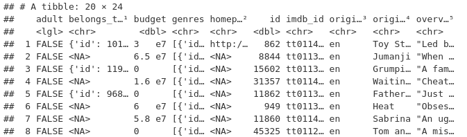
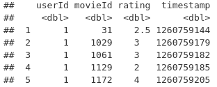
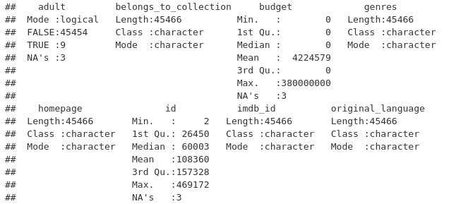
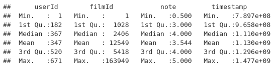
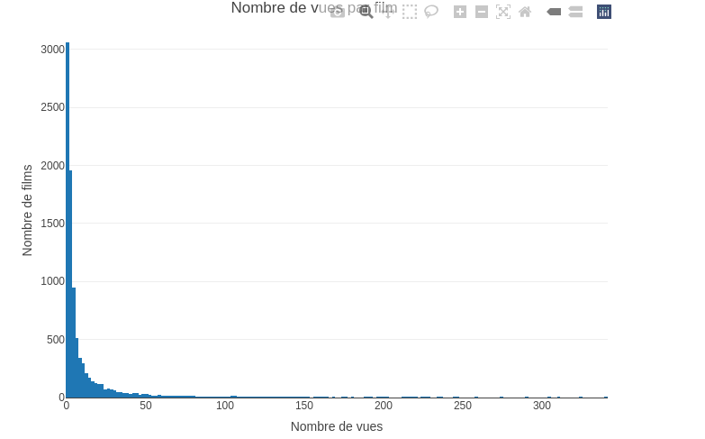
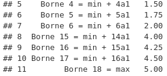
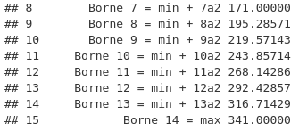
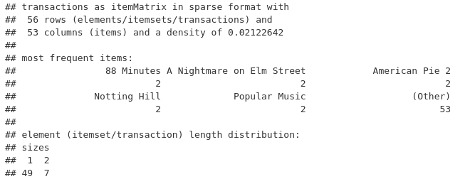
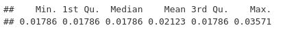

```{r setup, include=FALSE}
knitr::opts_chunk$set(echo = TRUE)
```

## RAKOTONIRINA Harimanga Valimbavaka Yannick - Introduction (1/2)
"arules" est une librairie du langage R qui permet de représenter, manipuler et analyser les données et les modèles de transaction à l'aide d'ensembles d'éléments et de règles d'association.


La librairie fournit un large éventail de qualité de mesures  et d’algorithmes de mining (exemple: Apriori ou Eclat.)

## RAKOTONIRINA Harimanga Valimbavaka Yannick - Introduction (2/2)
Dans cette guide d'utilisation, nous allons détailler l'utilisation de la librairie avec le dataset "movies" et "ratings".

Le dataset "movies_metadata" contient les identifiants et les titres des films. Le dataset "rating_small" contient les notes de chaque utilisateurs pour les films qu’ils ont visionnés ( sur une échelle de 1 à 5).

## RAKOTONIRINA Harimanga Valimbavaka Yannick - Sénarios 1: Examen des variables(1/6)

Charger les datasets
```{r chagrer dataset film, eval=FALSE}

library(readr)
film <- read_csv("movies_metadata.csv")
#afficher les 5 premiers lignes de données
film[1:5,]
```

## RAKOTONIRINA Harimanga Valimbavaka Yannick - Sénarios 1: Examen des variables(2/6)
Le dataset "film"



## RAKOTONIRINA Harimanga Valimbavaka Yannick - Sénarios 1: Examen des variables (3/6)
```{r charger dataset notation film,eval=FALSE}
library(readr)
notation_film <- read_csv("ratings_small.csv")

#afficher les 5 premiers lignes de données
notation_film[1:5,]

colnames(notation_film)<-c(
  "userId","filmId", "note","timestamp")
```

## RAKOTONIRINA Harimanga Valimbavaka Yannick - Sénarios 1: Examen des variables(4/6)
Le dataset "notation_film"


## RAKOTONIRINA Harimanga Valimbavaka Yannick - Sénarios 1: Examen des variables (5/6)
Description statistique du dataset "film"
```{r description statistique  du dataset film,eval=FALSE}
summary(film)
```



## RAKOTONIRINA Harimanga Valimbavaka Yannick - Sénarios 1: Examen des variables (6/6)

Description statistique du dataset "notation"
```{r description statistique du datast notation,eval=FALSE}
summary(notation_film)
```



## RAKOTONIRINA Harimanga Valimbavaka Yannick - Sénarios 2: Sélection de variables plus pertinentes - MOTIF DE SELECTION (1/4)

MOTIF DE SELECTION

Pour le dataset "film": On choisi le variable "id" et "titre" pour constituer la base de transaction.Puisque les données de ces colonnes sont complets (il n'y a pas de donnée qui manque)

"id": car c'est un identifiant unique qui permet trouver un film dans le dataset.
"titre": car le titre est une condition nécessaire et suffisante pour le concept film.
  
Pour le dataset "notation": On choisi toutes les variables sauf "timestamp". On peut omettre cette variable car on peut englober le timestamp par une classe délimiant le temps de toutes les notations.

## RAKOTONIRINA Harimanga Valimbavaka Yannick - Sénarios 2: Sélection de variables plus pertinentes (2/4)

```{r selection des variables pertinentes,eval=FALSE}
film <- subset(film, select=c("id" ,"title"))

#on supprime les virgules dans les titres
film $title<- str_replace_all(film$title, ",", " ")

notation_film <- subset(notation_film, select=c(
  "userId","filmId", "note"))

#changement de format
notation_film$filmId<-as.character(notation_film$filmId)
notation_film$userId<-as.character(notation_film$userId)
```

## RAKOTONIRINA Harimanga Valimbavaka Yannick - Sénarios 2: Sélection de variables plus pertinentes (3/4)

```{r visualisation des fimls peu visioné,eval=FALSE}
#Nombre de vues des films
freq_film <-count(notation_film,c("filmId"))
names(freq_film)<-c("filmId","Number_view")   
plot_ly (x=freq_film$Number_view, type = "histogram")%>%
layout(title = 'Nombre de vues par film',
xaxis = list(title = 'Nombre de vues'),
yaxis = list(title = 'Nombre de films'))
```

## RAKOTONIRINA Harimanga Valimbavaka Yannick - Sénarios 2: Sélection de variables plus pertinentes (4/4)

Histogrammes du nombres de vues 


## RAKOTONIRINA Harimanga Valimbavaka Yannick - Sénarios 3: Discrétisation de variables quantitatives (heuristique) (1/8)

Discrétiser c'est réaliser un découpage en classes des variables quantitative et ensuite nommer les classes.

Dans le dataset "rating" (notation des films),la variable "note" est quantitative et on veut catégoriser en classe les notes.
Et dans le dataset "movies" (les films), la variable "nombre de vue" est aussi quantitative et on veut catégorisé en classe de nombre de vue.

Interêt de la discrétisation: Pour séléctionner les données à charger dans la base transactionnels. On séléctionne uniquement les classes qui sont utiles pour la prise de décisions.

Pour les 2 datasets (film et notation): les films peu visionnés et les films mal notés ne seront pas ajoutés dans la base de données transactionnelles. On réalise alors une discrétisation des variables "note" et "nombre de vues".

## RAKOTONIRINA Harimanga Valimbavaka Yannick - Sénarios 3: Discrétisation de variables quantitatives (heuristique) (2/8)

a) DETERMINER LE NOMBRE DE CLASSE

L'une des méthodes heuristique pour déterminer le nombre optimale de classe, utilise la formule de HUNTSBERGER:
1+3.3*log(N1,base=10) 
avec N:somme des éfféctifs de la variable à discrétiser
```{r nombre de classe "note",eval=FALSE}
#Pour la variable "note" (dataset "rating")
N1=length(notation_film$note)
1+3.3*log(N1,base=10)
```

```{r nombre de classe "nombre de vues",eval=FALSE}
#Pour la variable "nombre de vues" (dataset "movies")
N2=length(freq_film$Number_view)
1+3.3*log(N2,base=10)
```

## RAKOTONIRINA Harimanga Valimbavaka Yannick - Sénarios 3: Discrétisation de variables quantitatives (heuristique) (3/8)

b) CHOISIR LES BORNES DE LA CLASSE

La méthode utilisée est la METHODE DES CLASSES D'AMPLITUDE EGALES.

```{r borne de classe "note",eval=FALSE}
#Amplitude: a=(max-min)/k, avec k=18 (on arrondit 17.56 à 18) tel K est le nombre de classe
a1 = (max(notation_film$note)-min(notation_film$note)) 
          / 18
```
```{r borne de classe "nombre de vues",eval=FALSE}
#Amplitude: a=(max-min)/k, avec k=14 (On arrondit 14.05 à 14)
a2 = (max(freq_film$Number_view)-min(freq_film$Number_view)) 
          / 14
```

## RAKOTONIRINA Harimanga Valimbavaka Yannick - Sénarios 3: Discrétisation de variables quantitatives (heuristique) (4/8)

Les bornes de la classe "note"


## RAKOTONIRINA Harimanga Valimbavaka Yannick - Sénarios 3: Discrétisation de variables quantitatives (heuristique) (5/8)

Les bornes de la classe "nombre de vue"



## RAKOTONIRINA Harimanga Valimbavaka Yannick - Sénarios 3: Discrétisation de variables quantitatives (heuristique) (6/8)

Dans ces 2 discréction de variables, on en déduit que:

a) la notation des films les plus appréciées appartienne à la classe des valeurs [4;5]. On peut en déduire que les film les mieux notée ont la note supérieur ou égale à 4.On utilisera cette condition pour remplir la base de donnée des transactions.

b) La classes des valeurs des films les plus visionnées sont les films ayant des nombre de vues entre [200;341]. On utilisera la condition nombre de vue supérieur à 200 pour remplir la base de données des transactions.

## RAKOTONIRINA Harimanga Valimbavaka Yannick - Sénarios 3: Discrétisation de variables quantitatives (heuristique) (7/8)

```{r filter les variables pour former les paniers de transactions,eval=FALSE}
#On en conserve que les films avec des notes supérieures ou égales à 4
notation_film <- notation_film[notation_film$note>=4,]

# On filtre les films moins de 200 vues (moins visionés)
notation_film<-merge(x = notation_film, y = 
      freq_notation_film, by = "filmId", all.x = TRUE)
notation_film<-notation_film[freq_film$Number_view>200,]

#Dans le même tableau, on ajoute le nom des films et on ne 
#conserve que les films qui ont un nom
names(film)=c("filmId", "titre")
notation_film<-merge(x = notation_film, y = film, 
                     by = "filmId")
```

## RAKOTONIRINA Harimanga Valimbavaka Yannick - Sénarios 3: Discrétisation de variables quantitatives (heuristique) (8/8)

Transformer les données en données « basket » ou « panier » ( i.e  format transactions): Pour pouvoir utiliser la fonction arules qui permet de calculer les règles d’association.

```{r transformer les données en transactions,eval=FALSE}
#On transforme les données en "panier" dans un fichier csv
notation_itemList <- ddply(notation_film,c("userId"),
function(df1)paste(df1$titre,collapse = ","))
notation_itemList<-notation_itemList$V1
write.csv(notation_itemList,"ItemList.csv", quote = FALSE, row.names = TRUE)
#Lecture de la transacion à partir du csv
transaction = read.transactions(file="ItemList.csv", rm.duplicates= TRUE, 
      format="basket",sep=",",cols=1)
```

Résultats: pour chaque utilisateur, la liste de tous les films qu’il a visionnés et pour lesquels il a attribué une note supérieure ou égale à 4 sont affiché.

## RAKOTONIRINA Harimanga Valimbavaka Yannick - Sénarios 4: Choix du seuil minimum du support (heuristiques) (1/4)
Examinons d'abord les données de transaction :


## RAKOTONIRINA Harimanga Valimbavaka Yannick - Sénarios 4: Choix du seuil minimum du support (heuristiques) (2/4)

Examinons le quantile de la fréquence des items :


## RAKOTONIRINA Harimanga Valimbavaka Yannick - Sénarios 4: Choix du seuil minimum du support (heuristiques) (3/4)

L'élément unique le plus fréquents a comme support de 0.03571. si l'on prend un support de 0,33 sur la transaction.On obtiendra aucune règle avec apriori. On doit reduire le support.
Si l'on souhaite rechercher des ensembles d'éléments/règles qui apparaissent au moins 10 fois dans la base de données des transaction, on définit le support minimale sur: 10 / taille_de_la_base_de_transaction.

L'heuristique du choix du minimum de support est alors: n / length(base_de_donne_des_transactions). 
Avec n: nombre d'éléments/règles que l'on souhaite au moins apprarître n fois dans la bases de donnée transactionnelles.
Et length(): la fonction R qui retourne la taille de la base de données des transactions.

## RAKOTONIRINA Harimanga Valimbavaka Yannick - Sénarios 4: Choix du seuil minimum du support (heuristiques) (4/4)
Pour le dataset des films et des ses notations: le support minimun est 0,017 car:
```{r heuristique support minimum,eval=FALSE}
n = 1
n / length(transaction)
```


